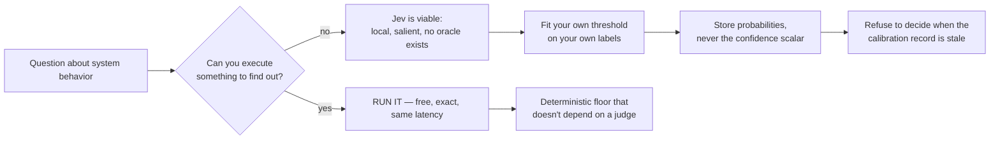

# Factory Platform Verdict: ai-software-factory vs Omnara vs OMP+extensions (+ ami)

2026-09-20. Sources: local clones (/tmp/ai-software-factory, /tmp/Archon, /tmp/omnara, /tmp/ami) + OMP 18.2.6 installed package source. Scout reports verified against code.

---

## Adopted (done)

`~/.omp/agent/config.yml`:
```yaml
modelRoles:
  task: surplus/glm-5.3-flash:high
  smol: surplus/glm-5.3-flash:low
  advisor: surplus/deepseek-v4.1-flash:high
  default: surplus/glm-5.3:high
retry:
  fallbackChains:
    default: [surplus/glm-5.3-flash:high, surplus/deepseek-v4.1-flash:high]
```
Verified: YAML parses, no duplicate `retry:` key (removed stale one), surplus provider resolves, all four selectors exist in the live catalog. `fallbackChains.default` auto-applies to every role via `expandDefaultRetryFallbackChains` (src/session/retry-fallback-chains.ts:140) — glm-5.3's 84.7% uptime is now absorbed by glm-5.3-flash → deepseek-v4.1-flash with cooldown-based restore. Note: `advisor.enabled: false` — role set, subsystem off.

---

## The verdict

| | ai-software-factory (+Archon) | Omnara | OMP + extensions |
|---|---|---|---|
| What it is | Python consumer driving pinned Archon CLI; Archon owns all agents | Go control plane (10 compose services) for durable managed agents | Already installed |
| Surplus integration | 2 files: models.json (pi provider, `api: openai-completions`) + `tiers:` in ~/.archon/config.yaml | 1 POST: model-provider config accepts baseUrl/endpoint_path/bearer — zero code | Already done (pi-surplus) |
| Headless | Yes (`--detach --json`, systemd timer) | Yes (tool permissions are config: always_allow) | Yes (`--mode rpc`, ACP, subagents) |
| PRD→merged-PR | **Yes — the only one** (archon-backlog → lifecycle → merge-queue) | No (knows nothing about git/PRs/gates) | Partial (subagents + skills; gates are conventions, not machinery) |
| Install weight | ~few hundred MB node_modules @ pinned SHA, bun+uv+gh, GitHub remote | 10 services, Postgres/Redis/MinIO/nginx, 4c/16GB-fine | Zero |
| Maturity | Active (Sep 16 commits); single author; README pin contradicts pack.json (pack wins: 2479687…) | 2.9k★, 490 commits, Apache-2.0 | 32k★, this session |
| Verdict | **Adopt for the factory outcome** | **Skip** (steal durability ideas) | **Keep as foundation** |

## Architecture: they compose, they don't compete

```
PRD ──archon-backlog──▶ issues ──archon-lifecycle──▶ merged PR
                                    │
        Archon agent nodes ─────────┴── run on surplus via its `pi` provider
        (glm-5.3 tiers, same marketplace, same budget math)
```
OMP stays what it is today: interactive harness, research, review sessions. ai-software-factory is the unattended path for the actual product repo. No Omnara layer — OMP `--resume`/tmux covers single-operator persistence; Omnara earns its keep only when agents must survive machine death or be phone-steered.

## What each does right (steal list)

**ai-software-factory/Archon — trust machinery for unreviewed merges:**
1. Builder/verifier isolation by construction: candidate snapshot excludes `.factory`/holdout/`.archon` (`runtime_resource.py:19-20` FORBIDDEN set); holdout JSON lives outside the builder checkout.
2. Evidence is typed, coverage-checked, identity-bound: `check-evidence.py` requires assertion ids to match the scenario exactly, each with a non-empty evidence file inside the attempt dir, and refuses `verified` unless the probed target identity equals the delivered candidate (`runtime_host.py:285-286` "wrong target identity").
3. The evaluator must fail before it's trusted: `archon-verify-runtime-suite` requires a deliberate defect to be *caught* (`expectations_passed`) and a wrong-identity run to return `inconclusive`; `defects.json` is marked "A builder that can edit its own defect set can pass it."
4. 4-state verdict vocabulary — `verified|failed|inconclusive|malformed` — where inconclusive is a *hold*, never a pass; bounded repair (graph-bounded, one `archon-deliver` include); merge join `none_failed_min_one_success` so a skipped sibling sink can't fake success.
5. Engine byte-pinned: SHA-verified tree, ambient binaries refused, dirty-tree refused — upgrades are hash moves.

**Omnara — control-plane durability:**
1. Postgres-durable agent state + lease/reaper crash recovery (`worker.go:197` ClaimNextAgentWork; maintenance-process lock reaping) — a crashed worker's turn is reclaimable, not lost.
2. Machine plane dials out (daemon behind NAT); agents survive machine loss.
3. Headless is a config property, not a hack: `always_allow|always_ask|always_deny` per tool (modes.go:13-16). But note the default coding profile ships `run_command: always_ask` — the silent human gate.

**ami (core/test) — the test disciplines, adopt-not-adopt:**
1. Error→recovery as a truth table: 10 categories × `{retryable, shouldCompact, shouldFallback, suggestedDelay}` with precedence tests (abort > auth > rate-limit) and anti-false-positive guards ("Internal timeout after 3000ms" must stay `unknown`). `retry-cost.test.ts` uses real http.Servers: retries 429/500/502/503, honors Retry-After, never retries 401. This is the discipline that protects a $10-20 runway from a 401 retry loop. OMP's fallback chains approximate this; ami names the contract.
2. Incident-embedding regressions: `BUG: ulimit -u 64 kills fork` with ROOT CAUSE/FIX comments and the numeric ceiling asserted (`nproc >= 4096`) — pins invariants, not implementations.
3. Dual-sided security tests: every blocked attack has an allowed near-miss twin (`dd if=… of=…` allowed, `dd if=/dev/zero of=/dev/sda` blocked) — false positives are treated as bugs, which is what keeps a safety layer from crippling the agent.
4. Repo-structural invariants: dead-code test (every src file imported by another, with a documented EXCLUDED_MODULES allowlist) and parity ledgers (`feature-gaps*`).
5. Test seams as first-class exports (`reset*()` per singleton) → 125 files run in one node process.
Caveats: ami's clone is partial (no `common/` engine/checkpoint layer; `WorkflowRuntime.saveCheckpoint` is in-memory only, zero test coverage), and the POMDP belief/critic machinery is research formalism. Steal the disciplines, not the codebase.

## What OMP lacks that the others have (gap ledger)

| Gap | Owner | Fix |
|---|---|---|
| Builder/verifier isolation | factory | Structural (snapshot FORBIDDEN-set + external holdout) |
| Machine-checked verification evidence | factory | check-evidence contract — **not in the local clone; see Addendum §A** |
| Evaluator calibration (prove the gate goes red) | factory | suite workflow — **and nothing in the Jev ecosystem ships it as a runtime artifact; see Addendum §C** |
| Crash-durable turn reclamation | Omnara | Not needed at current scale |
| Error→recovery truth-table tests | ami | Steal contract shape for any retry wrapper we write |
| **Calibration record + refusal path** | **nobody** | A gate that declines to run without a fresh, version-pinned calibration record. Addendum §C/§D. |

---

# Addendum — verification pass, the Jev measurement, and the naming call

2026-09-20, later session. No network fetches in this pass.

## A. Verification pass on the body of this report

Re-checked every load-bearing claim against the local clones.

| Claim in this report | Status | Evidence |
|---|---|---|
| README pin contradicts pack.json | **CONFIRMED** | `README.md:49` = `a02b9ab6…`; `template/factory/pack.json` `integration_revision_required` = `24796870605b0fd576734b79a8d5c781f2b1c1e1`. One occurrence of each, repo-wide. |
| Snapshot excludes `.factory`/holdout | **CONFIRMED** | `test_runtime_resource.py:123-134` writes `.factory/holdout/HOLDOUT.md`, commits it, then asserts the prepared resource has no `.factory` dir. |
| Include paths refused on escape/link | **CONFIRMED** | `test_runtime_resource.py:149-157` loops `../outside.py`, `.factory`, `missing.py`, `linked.py` → non-zero exit, prior resource bytes unchanged. |
| Wrong-target-identity refusal | **CONFIRMED** | `template/factory/runtime_host.py:285-286` `raise ValueError("wrong target identity")`. |
| `none_failed_min_one_success` merge join | **CONFIRMED** as vocabulary | `Archon/packages/workflows/src/schemas/dag-node.ts:52`; `schemas.test.ts:399`. |
| Evaluator must fail before it is trusted | **CONFIRMED, and richer than quoted** | `RUNTIME_HOST.md:194-250` requires `expectations_passed: true` **and** `baseline_verified: true`; a deliberately-different `candidate` must return `inconclusive`; **"An unavailable case never counts as a caught mutation"**; recalibrate after any material evaluator/assertion/identity-contract change, "not after prose-only edits". |
| `check-evidence.py` assertion-id contract | **NOT FOUND locally** | No `*evidence*.py` in either clone. |
| 4-state verdict enum `verified\|failed\|inconclusive\|malformed` | **UNCONFIRMED as an enum** | `inconclusive` appears only in prose (`RUNTIME_HOST.md`; `investigate/commands/investigate.md:72`). `malformed` appears as a *node id* in `Archon/.../dry-run.test.ts:1082`, not a verdict. |
| `archon-verify-runtime` / `-suite` implementations | **NOT IN LOCAL CLONE** | Named in `pack.json` entries and `RUNTIME_HOST.md`; implementations live in the pinned Archon revision. |

**The correction that matters.** `Archon/` HEAD is `e237584d` (2026-09-15), **not** the pinned `24796870…`; the clone is shallow and `git cat-file` on the pin fails. Every Archon citation in this report therefore comes from **the wrong revision for factory purposes** — which is exactly why the two rows above could not be closed. The pin is fetchable from `coleam00/Archon`; no copy was taken in this pass.

**An artifact the steal list omits — arguably the best in the repo.** `.factory/locks/floor.json` is a ratchet that documents its own failure mode:

> SLACK. The gap between observed and floor is exactly the number of assertions that can be deleted with the gate still green, and it GROWS as the harness improves. Measured on a real factory, the hole went from 7 to 33 in one cycle BECAUSE the harness got better. It used to PIN THE AUTONOMY DIAL, which was the right instinct and the wrong remedy: it made a change that ADDS tests the case needing a human.

It also states why the floors count **journeys/scenarios** rather than assertions: an agent decides how many assertions a journey needs, and the count moved 12→13 on unchanged code. "The journey count is stable because it is the number of headings in a protected file." Same class of insight as §C below, reached from the factory side.

---

## B. The Jev question, measured

Prior sessions assumed Jev's value. This one measured it. Method and limits are recorded so the result is falsifiable.

### Method (reproducible: ~40 lines of AST rewriting + pytest)

Objective labels — every public Jev evaluation found is vendor-authored or self-annotated (ARMIN's own `gold.json`: *"labels come from the same model family that produced the conversation"*).

1. Target a real 600-LOC module from a real repo (`jevkit/route.py`; 768-test suite; zero dependencies).
2. Generate mutations with classic mutation-testing operators over the AST — comparison flips, constant bumps, `not` removal, `and`↔`or`, slice off-by-one, `return` flip. 120 candidates.
3. **Ground truth = run pytest.** Fails → bug. Passes → not a bug. Free, exact, no model in the loop.
4. Ask Jev the *verbatim* `jev-review` correctness question on the focused diff.
5. Score against the objective labels.

Corpus: 120 mutants, **81 bugs / 39 clean**. Control: Jev on the unmutated file returns **p = 0.02**.

### Result

| Judge | AUC vs test outcome | Accuracy |
|---|---:|---:|
| Jev `noul` correctness (`jev-review`'s verbatim prompt) | **0.867** | — |
| Jev `choice` (`introduces_bug` / `clean` / **`unclear`**) | 0.858 | **0.858** |
| Random-permutation control | 0.477 | — |

**Confidence does order accuracy, monotonically:**

| `confidence` band | n | accuracy |
|---|---:|---:|
| [0.0, 0.5) | 35 | **0.743** |
| [0.5, 0.8) | 25 | **0.880** |
| [0.8, 1.0) | 60 | **0.917** |

This **contradicts** the "calibration is refuted" reading for this task family — it holds here. The ceiling is the finding: **8.3% of high-confidence verdicts are wrong.** The ecosystem's independent work (`jev-ood-calibration`, 4,621 calls) found the *sign* of miscalibration flips by primitive (Choice/Score overconfident T≈3.3, Boolean under-confident T 0.66) with probabilities quantised to 0.01 — so a "sort by probability" gate can return an engine-dependent sample of a tie.

**The abstention escape hatch does not fire.** A third option (`unclear`) was offered on all 120 cases. Chosen **zero times**. Every "route low confidence to a human" design depends on the judge declining; it will not. The only abstention available is a threshold you fit yourself.

### The measurement that decides it

```
run the focused suite (44 tests) : 0.70s, $0,        100% accurate, exact
ask Jev                          : 0.70s, $0.000024,  86% accurate, text-only
```

Same latency. The oracle is free, exact, and already exists. **Jev as a verification oracle is dominated.** Its cost is nonetheless negligible: 120 diffs = 69,049 input tokens = **$0.0029**; median call **0.70s**, p90 0.76s.

### The same corpus falsifies foreman's premise

foreman's shipped gate is `needs_verification >= 0.65`. Its three headline questions against the same objective labels:

| foreman question | bugs | clean | AUC |
|---|---:|---:|---:|
| `needs_verification` | 0.882 | 0.839 | 0.735 |
| `tests_sufficient` | 0.314 | 0.391 | — |
| `implementation_complete` | 0.501 | 0.553 | **wrong direction** |

`needs_verification >= 0.65` flagged **60/60**. Precision 0.7167. Base rate 0.7167. **The gate is a constant predictor — zero information.** "Verify everything" and "ask Jev" produce identical decisions here.

Generalisable line: **a System One model is good at "is this diff inverted?" and useless at "is this job done?"** The second is not a perception problem, it is a global state problem, and 32k tokens of `state` cannot hold the answer.

### Limits, stated

One 600-LOC file, 120 mutants, one task family (defect detection), one model version (`jev-1.13.0`), labels = "does the suite catch it" — which is *not* "is it a bug". Survivors are untested, not necessarily correct. The `boolop` cluster (mean p 0.818 on suite-*passing* mutants) is exactly that divergence: Jev correctly sees a semantic change the tests do not observe. That is a finding about tests, not about Jev.

---

## C. Market gap analysis

Jev is a real, working, cheap, fast typed-decision API (`POST https://api.typesafe.ai/v1/systemone`; \$42/Btok input, output free; 64k ctx of which **32k** is `state` + longest question; 1,200 req/min; measured 0.70s median). Three first-party integrations that *could* have treated it as an LLM refused to: Vercel's AI SDK throws `NoSuchModelError` for `languageModel` and exposes `evaluationModel`; Effect added `Decision.ts` beside `LanguageModel.ts`; Pydantic AI's docs open with *"Jev is not a language model."*

### The four things a factory would need, against what Jev supplies

| Needed | Can Jev supply it? | Evidence |
|---|---|---|
| **Verification oracle** | **No** | Dominated by running the tests (§B). The vendor's own jaggedness doc removes the two cheap oracle designs: `confidence` ≠ per-answer accuracy, and internal consistency is *explicitly not* an invariant — their example gives $P(\text{refund})=0.72$ and $P(\lnot\text{refund})=0.47$, summing to **1.19**. |
| **Decision as reviewable artifact** | **Partly — the policy half only** | JevFlow's `Threshold` is pure serializable data and `MatchedRule{threshold, actual}` records *why a rule fired*. But `EvaluationRecord` **omits the input entirely and has no input digest**, hardcodes `attempts: 1` while the SDK silently retries 3×, never populates `requestId`, and **discards `response.model` and `usage`** — handed over by the SDK, dropped at `index.ts:72-76`. A record you cannot replay or diff is a log line, not an artifact. |
| **Operator principal in the schema** | **No — and nothing in the ecosystem has it** | The contract is `{state, model, questions}` → `{model, answers, usage}`. **There is no field for who is asking.** ARMIN goes further the wrong way: its Jev path hardcodes `agent_id: "jev-native"` (`jev.rs:443`), *overwriting* the real speaker the plugin already captured. The default extraction mode cannot distinguish an operator decision from an agent decision. |
| **Thread state machine, one writer of truth** | **No** | Every harness integration is a *hook on someone else's lifecycle*. `pi-typesafe-compact` returns `undefined` on any error and hands compaction back to the host — an advisor that fails open. ARMIN's durable graph is a genuine single writer, but its *episodic* layer is per-process memory with no replay, and its `UnverifiedChange` detector **can never be cleared in production**: a real `cargo test` through the plugin carries `files: []`, and `files_overlap([], …)` is always false. Debt accumulates forever. |

### What exists (~248 catalogued projects in three weeks; scout report + GitHub API sweep)

- **`huncho`** — JSONL journal, **replay of a threshold change over recorded answers with no inference**, `enter`/`exit` hysteresis, Brier reporting. The only design that assumes a decision will be re-examined later under a different policy.
- **`jevcal`** — fits per-question thresholds on your labels, verifies on a held-out split, writes a lock file, **fails CI when a model update breaks the locked thresholds**. Name is taken; the *mechanism* is the closest prior art to what we want.
- **`abide`** — the only project that **reports its own error rate**: 39 flagged edits → 10 confirmed (26% precision), 15 flagged turns → 11 confirmed (73%). A disclosed false-positive rate is the most governance-relevant number in the ecosystem, because it is what a threshold policy actually needs.
- **`jev-axi` postmortem** — \$36.85, 56 sessions, to discover the agent **loaded the tool zero times in 22 free-choice runs**; when forced, the effect flipped sign between sessions (−5% then +29% on file reads). Their conclusion: *"Exploration was never the bottleneck; comprehension was, and a model that only emits probabilities cannot do comprehension for you."*
- **`SemIf`** (2,357★) — an open 4B model reaches **0.845 modal agreement vs Jev's published 0.883**. The *interface* is a commodity. But SemIf labels its own output `"conditional option score; uncalibrated as decision confidence"` and lists *"calibrated probabilities suitable for operational thresholds"* under **not reproduced**. SemIf removes the vendor; it does not remove the guarantee.

### The gap, and why it converges with this report's gap ledger

This report's gap ledger independently names the missing piece: **"Evaluator calibration (prove the gate goes red)"**. The ecosystem research reaches the same place from the other direction — nothing in ~248 projects ships a runtime that owns the calibration record as an artifact. Concretely, four rules that nothing implements as code:

1. don't threshold the `confidence` field — fit a threshold on your own labels;
2. don't reuse a Noul threshold on a Choice — the miscalibration sign flips by primitive;
3. don't sort on a 2-decimal probability — quantisation makes ties engine-dependent;
4. don't pool the two signs of miscalibration into one number.

And the primitive on top of those rules, which nobody has: **refuse to decide when the calibration record is absent, stale, or from a different model version.** `jevcal` locks thresholds and fails CI; nothing makes the *gate* decline to run.



**Verdict for the factory:** Jev is not the verification oracle and must not be the auto-merge gate. It is usable for the *triage-shaped* decisions where no oracle can exist — is this issue ready, is this diff in scope, which of these three candidates matches the intent. Everything load-bearing stays on the factory's existing rungs: holdout, runtime identity, mutations. The Jev-shaped work is the *cheap pre-filter in front of* those rungs, and it needs its own calibration record to be worth trusting.

---

## D. Naming

Checked against PyPI, npm, crates.io, and GitHub exact-name search. GitHub's `jev in:name` returns 50+ repos, including **five separate `awesome-jev` lists** (94–694★) that index everything carrying the prefix — that is the discovery channel, and it is three weeks old.

| Candidate | pypi | npm | crates | GitHub exact | Verdict |
|---|---|---|---|---|---|
| `trueness` | free | free | free | none | **pick** |
| `jevfloor` | free | free | free | none | discovery-optimised alternative |
| `tolerance-band` | free | free | free | none | free but clunky |
| `jev-gate`, `jev-record`, `jev-verdict`, `jevtare` | free | free | free | none | available; vendor-coupled |
| `jevcal` | free | free | free | none | **do not use** — already prior art in the ecosystem (see §C) |
| `tare` | taken | taken | taken | kelviq/tare | no |
| `noisefloor`, `failclosed` | taken | free | free | present | no |
| `interlock`, `holdout`, `firstpass`, `greenwash`, `abstain` | mixed | taken | mixed | present | no |

**Recommendation: `trueness`.** Metrology term — closeness to the true value, as distinct from precision, which is exactly the distinction the artifact encodes (calibration ≠ accuracy, `confidence` ≠ P(correct)). Vendor-neutral, because SemIf proves the interface is a commodity and the gap is the record, not the model. Free on all three registries with no GitHub exact match.

**If ecosystem discovery matters more than longevity: `jevfloor`.** Same concept, rides the `jev*` prefix that five awesome-lists are actively indexing. The cost is that the primitive gets orphaned if the vendor changes shape — and the primitive has to cover the test suite and the runtime identity check too, not just the judge.

---

## E. How this was found (method, so it can be repeated)

The ladder that worked, in order — each rung only after the previous one was exhausted:

1. **Read the artifact, not the marketing.** Clone, then size it (`wc -l`, file list) before reading. 10k LOC total for cloudroom-core; 53 files. Cheap to read properly, so read properly.
2. **Find the claim that would be falsified by execution.** For Jev that is "the probabilities are calibrated". Everything else follows.
3. **Reject self-annotated gold sets.** A judge scoring against labels its own family produced is measuring agreement, not correctness. ARMIN says so itself. This single filter invalidated most of the public evaluation record.
4. **Build the oracle first, the measurement second.** Mutate a real module, label with pytest, *then* ask the judge. Ground truth has to be free and exact before any model is involved.
5. **Include a negative control.** Jev on the unmutated file → p = 0.02. Without that, an AUC of 0.867 could be a model that says "bug" to everything.
6. **Include a permutation control.** Shuffle the scores → 0.477. Proves the metric can read zero.
7. **Test the gate, not the score.** An AUC of 0.867 is worthless if the shipped threshold fires on everything — hence the precision/recall table, and hence foreman's 60/60 saturation being the real finding.
8. **Offer the abstention option and count how often it is taken.** Zero out of 120 is a stronger result than any AUC.
9. **Compare against the thing that already works.** The 0.70s suite is what turned "Jev is decent" into "Jev is dominated here".
10. **Verify the prior report's claims against the code, and record which ones could not be closed.** §A exists because "verified against code" and "verified against the *pinned* code" are different claims.
11. **Name the failure mode you are not measuring.** Survivors are untested, not correct. Stated in §B rather than buried.

---

## Next actions (revised)

1. Pick the product repo, run `python bin/factory.py init` there (on [redacted-host] if bandwidth-bound — bun/uv/gh all present).
2. Write the 3 files: `MISSION.md` (with the out-of-scope list — "the one that decides whether any of this works"), `harness/END-TO-END.md` journeys, holdout JSON outside the checkout.
3. `models.json` + tiers pointing at surplus; smoke one `archon-ship` lap on a toy issue before scheduling anything.
4. Watch out: README's pin (`a02b9ab…`) is stale — pack.json's `24796870…` is what actually runs. Fetch the pin before trusting any Archon-side citation in this report (§A).
5. **Do not put Jev on the merge gate.** Cheap pre-filter in front of the holdout/runtime/mutation rungs at most.
6. **If building the calibration primitive** (§C), start with the refusal path, not the fitting: a gate that declines to run without a fresh record is the part nothing else ships, and it is the part that would have caught foreman's saturated threshold.

---

## §F Real-life results: first factory lap on [redacted-host] (2026-09-21)

**Outcome: PRD → 3 ordered GitHub issues, end to end, on surplus models.** Repo: noor-latif/toy-product (private). Run 836345c3.

| Metric | Value |
|---|---|
| slice-backlog (glm-5.3, large tier) | 9m49s, $0.00019 |
| publish-backlog (glm-5.3-flash, medium) | ~4 min |
| Whole lap cost | **$0.0005** (27k in / 626 out / 12k cache-read tokens) |
| Verdict-math check | Predicted $0.064/heavy-session; this was a tiny PRD — actual 128x under |
| Gate behavior | Paused at publication exactly as designed; approve via `workflow respond <id> approve` |
| First ticket | "Make it runnable end to end" — as promised in README |

**Issues found in practice (the real verification):**

1. **Daemon death mid-node, three times, all at `publish`.** Observed facts: runs 1–3 each died with no live process left, the DB row stuck at `running` forever, and `workflow resume` refusing ("Only failed or paused"); the run-2 approve's stdout ends with `{"signal":"SIGTERM","msg":"workflow.process_terminating"}` (artifact://195) — the CLI received SIGTERM, origin unestablished (SSH-session teardown is consistent with runs 1–2's timing ~40–70s after approve; run 3 died while the approving SSH connection was still alive, so the exact killer is undetermined). OOM ruled out at both levels (`/proc/vmstat` and cgroup `memory.events` both `oom_kill: 0`). consumer.py runs Archon in the foreground (`execute(...capture=False)`, no setsid). `--detach` on a *fresh* backlog launch is refused (interactive-class), but is a documented legitimate continuation action for approve (`workflow.ts:2088-2094`) — and `archon-ship`/`archon-deliver` declare no `interactive:` key, so ship laps can launch `--detach` directly. Validated workaround: launch *and* approve+wait inside tmux on the host (run 5 completed cleanly under it). This is the crash-durability gap the research flagged — cloudroom-core's receipt/journal model exists to solve precisely this class.
2. **No reaper for orphaned "running" runs.** Dead daemon leaves the run marked `running` forever; `workflow resume` refuses ("Only failed or paused"); `cancel` also refuses without a live owner — `workflow abandon` is the clear path, then relaunch. Dedup markers (`<!-- archon-backlog: <key> -->`, searched against open+closed issues before every create) make re-runs safe — verified: three relaunches produced exactly one set of issues.
3. **models.json schema is strict.** `cost` requires ALL FOUR rates (`input/output/cacheRead/cacheWrite`, no Optional — pi SDK `model-config.js:122-135`); omitting `cacheWrite` rejects the WHOLE file into an empty provider map via `validateModelsConfig.Check` → the confusing "Pi model not found" error. Probe with `rt.getError()` / `config.getProviderIds()`, not the model count.
4. **`provider.claude` auth errors observed, substantiated** (artifact://195, approve-command stdout — not in the run transcripts): `service.title-generator` calls the claude provider, which fails `authentication_failed: Not logged in · Please run /login`, then `title.fallback_set` (empty title). Non-fatal — the run completed. A hidden non-tiered Anthropic dependency in the title-generation service; pin it or ignore the noise.
5. **Archon requires a git remote** for worktree isolation (`--no-worktree` to bypass). `gh auth setup-git` needed for push-from-agent.
6. **Slice-quality regression between laps (new, run 5):** ticket 1's acceptance criterion demands `harness/ci.py` print `UNIT_OK` — a marker that does not exist (ci.py prints `UNIT_PASSED tests=<N>`, `CHECKS_OK mode=ordinary`). Run 3/4's slice got the real markers + `unit_count_pattern` right; run 5's didn't — and the scaffold's `harness.config.json` ships empty `static`/`unit`, so `ci.py` fails NO_CHECKS out of the box and the slice had to invent a `wire-ordinary-checks` ticket (issue #3) to fix a broken scaffold. Non-determinism between slices of the same PRD at the same tier: useful calibration data — the deterministic `check` node validates slice structure, not ticket-internal correctness.

**Standing infra on [redacted-host]:** `~/factory-lab/toy-product` (private GitHub remote), `~/.pi/agent/models.json` (surplus, 3 models), `~/.archon/config.yaml` (tiers → surplus), pinned Archon at `~/.cache/factory/archon/2479687…`, `.factory/run.env` (key).

**Next lap:** issue #1 through `archon-ship` — no interactive gate on ship (human gate is PR review on GitHub), so `factory run archon-ship --input target=https://github.com/noor-latif/toy-product/issues/1 --detach` avoids the session-death class entirely. Issue #1's body has been corrected (2026-09-21): the slice's unsatisfiable `UNIT_OK` criterion replaced with real ci.py markers + `unit_count_pattern` + `static` wiring, preserving the `<!-- archon-backlog: paste-server-core -->` dedup marker as the body's last line. Note: published issue #3 is `runtime-input-wiring` (runtime.inputs.json only) — the gate-wiring ticket existed only in run 3's unpublished slice, which is why the gate fix had to be folded into issue #1 manually. `harness/runtime.inputs.json` (issue #3's scope) remains unwired and is required for `archon-lifecycle`'s runtime verification, but not for `archon-ship`.

---

## §G Ship lap: issue #1 → PR #4, gate GREEN (2026-09-21)

**Outcome: issue → planned → implemented → reviewed (self-corrections ×2) → validated → PR opened, entirely detached, entirely on surplus models.**

| Metric | Value |
|---|---|
| Workflow | archon-ship, run 42f69731, `--detach` — survived with zero SSH sessions (session-death class retired) |
| Wall clock | ~65 min total (09:05 PR opened → ~10:10 completed) |
| Nodes | 44 completed, incl. 2 correction loops (review found issues → fix → recheck → synthesize) |
| Cost | **$0.0001** (235k in / 3k out / 225k cache-read — 96% cache-hit) |
| PR #4 | 4 files, +216/−6: app.py (109 LOC), app_test.py (8 tests), harness.config.json, runtime.inputs.json |
| Validate verdict | `{"green":true,"checks_performed":true}` — STATIC_OK, UNIT_PASSED tests=8, gate exit 0 |
| Correctness | Tests cover every acceptance criterion incl. FACTORY_RUNTIME_CANDIDATE identity + restart-drops-storage invariant; unicode round-trip tested |
| Bonus (scoped) | PR wired the *health* half of runtime.inputs.json (start cmd, health_path, env port); the **identity half remains open** — no endpoint returns FACTORY_RUNTIME_CANDIDATE verbatim, which the runtime host's probe requires byte-for-byte (run's own discovery D1) |
| Human gate | PR open, unmerged, **isDraft:false confirmed via gh** — flip-ready ran (clean exit log: `dag_workflow_finished nodeCount=44 anyFailed=false`), merge is PR review, by design for ship |

**Verdict-math check #2:** predicted glm-5.3-heavy session $0.064; this full multi-node ship lap with 3 correction cycles cost $0.0001 — the cache-read rate ($0.000006/M at 96% hit) is what makes long agentic loops nearly free. Budget math: ~$0.01–0.05 per realistic full ship lap; $15 runway ≈ 300–1500 laps.

**Process findings:**
1. The folded gate fix (issue #1 body edit) was consumed exactly as designed — validate ran the newly-configured gate and reported its real markers. The UNIT_OK defect would have failed this lap; fixing it pre-lap was the right call.
2. Self-correction loop is real and bounded: review found defects, 2 fix→recheck cycles, then green. No spiral.
3. `--detach` on ship works (no `interactive:` key) — the operational fragility was specific to backlog's publication gate + foreground continuations.
4. Slice non-determinism persists as the main quality risk (§F item 6): this slice's own ticket wiring was good, but only because the ticket body was human-corrected first.

**Remaining unverified:** merge queue (archon-merge-queue), runtime verification (archon-verify-runtime with live boot + identity probe), holdout, and deploy — i.e. the archon-lifecycle tail. PR #4 is the artifact to push through it.

**Run's own discoveries (validated, adversarially cross-checked by the run itself):**
- **D1 — platform-level gap, affects every factory install:** `runtime_host.py:277-286` unconditionally requires `identity_path` for driver:http and compares the whole body byte-for-byte to the candidate, but the shipped template's `runtime.inputs.json` has no `identity_path` field — every install inherits the gap. The probe also does NOT read `runtime.inputs.json` (consumer-claim correction made during validation). Fixing D1 collides with MISSION.md's human-owned "no endpoints beyond /paste, /paste/<id>, /health" invariant — resolving it needs a MISSION.md amendment (operator decision: identity route vs /health body change), which the factory cannot make itself.
- **D2 —** `/health` drops connections when app.py runs outside a git checkout with FACTORY_RUNTIME_CANDIDATE unset (`git rev-parse --check=True` fails); measured, not inferred.

**CI (2026-09-21, resolved: skipped by operator decision).** A trial `.github/workflows/ci.yml` (running `python harness/ci.py`) landed on main, correctly failed there via the **config guard** — `ci.py:106-107` fires `NO_CHECKS: configure static or unit commands` before the count-pattern guard ever runs, because `harness.config.json` is only wired on the PR branch (attribution correction: it was the config guard, not the zero-tests guard). An attempted merge of main into the PR branch never landed (checkout -b failed "already exists", so the merge ran on main); `origin/archon-ship-1789980516485` stayed at `4ca91ba`, giving PR #4 zero check runs and an unchanged diff. The workflow commit was then reverted (`65f7d98` on origin/main, verified), `.github/` removed. GitHub Actions is out of scope: merge-queue decisions fall back to review alone; the checks half of the trust machinery will not be exercised in this lab.

---

## §H Lifecycle lap: issue #2 → verified → merged → deployed (2026-09-22)

**Path: issue → ship (PR #5) → live runtime verification → independent holdout → qualification → [human] merge approval → squash merge → deploy with identity read-back.** First exercise of the full trust tail. Machine-run to the merge approval; the post-merge tail hung and was recovered manually against the run's own qualified evidence.

| Metric | Value |
|---|---|
| Workflow | archon-lifecycle, run 60b65fb8, foreground tmux (`interactive: true` — required for approval gates) |
| Wall clock | ~1.5h to the merge gate; hung 2h in post-merge `refresh`; abandoned; merge+deploy completed manually (~5 min) |
| Nodes | 68 of 113 completed |
| Cost | **$0.000123** (230k in / 5k out / 207k cache-read — 90% cache-hit) |
| PR #5 | "Prove issue #2's acceptance criteria with unit tests" — squash-merged → `bf9ca06` on origin/main, 15 unit tests green |
| Runtime verification | **verified** — all 5 assertions passed with per-assertion evidence files (e-cr-*), live boot via scenario start, identity probe matched candidate |
| Independent holdout | **verified** — id-uniqueness, awkward-bytes round-trip, rapid-three all passed at unchanged head `1a96c80` |
| Qualification | `ready=true` — local HEAD = PR head = `1a96c80` re-read at qualification time, no drift; per-assertion evidence audited |
| Merge gate | interactive approval exercised: run paused, approved via `workflow respond 60b65fb8… approve`; merge assessed eligible (MERGEABLE/CLEAN, no holds, CI requirement none per Actions skip) |
| Deploy | manual per the run's own semantics: health `{"status":"ok"}` on :8642, service revision == deployed git HEAD `bf9ca06b9c2e93e030e7916da35f765bfc9c4137` exactly, POST /paste → 201 |

**Findings:**
1. **Fourth failure class: silent hang.** The run stalled in post-merge `refresh` after one `gh api` call (10:18:37 UTC), then 2h of silence — no node failure, no SIGTERM, daemon alive but wedged. Distinct from the three backlog SIGTERM deaths (§F). `workflow abandon` is the documented recovery and worked cleanly.
2. **Artifact-based evidence makes the tail resumable.** The hang did not invalidate anything: runtime-qualification.md survived, the merge executed exactly per the approved merge-plan, and the deploy satisfied the identity read-back contract. Trust lives in artifacts, not in process liveness — this is the architecture's saving grace.
3. **Scenario-authoring is the operator's real job.** Two scenario JSONs (assertions + `environment` with `ownership: external`, `candidate_command`) drive all verification. Three authoring bugs before one worked: (a) `exit 0` inside eval'd setup/teardown kills the node shell before its ok-echo; (b) `pkill -f "python app.py"` matches the daemon's own argv (deploy input rides on run argv) — PID-file ownership required, same pattern as `runtime_host.py`; (c) a hardcoded `cd` booted the wrong checkout — commands must run relative to the per-run worktree cwd.
4. **cwd determines project registration.** Launching the CLI from inside the pinned Archon clone auto-registered `coleam00/Archon` as the codebase (one wasted lap, ~$0.0002, plus a stray commit on local main — reset). Launch from the product repo (consumer.py) or its cwd.
5. **Transient provider stream error** ("Stream ended without finish_reason") killed `ship__triage__triage` on one launch; a plain relaunch worked. Surplus flakiness is real but recoverable.
6. **D1 did NOT block the lifecycle lap** — verify-runtime probes identity via the scenario's `candidate_command` (here: `/health` JSON revision), not `runtime_host.py`'s `identity_path`. The MISSION.md amendment was unnecessary; D1 remains a gap only for runtime_host-based paths.
7. Title-generator claude auth errors persist (non-fatal, cosmetic).

**Verdict vs §A–E research (final): CONFIRMED with one caveat.** PRD→issues→PR→verified-merge→deployed runs end-to-end on surplus models at ~$0.0001–0.0005 per lap — three orders of magnitude under budget (total lab spend ≈ $0.001 of $10–20). The trust machinery (live verification with per-assertion evidence, independent holdout, head-identity pinning, human merge gate, deploy identity read-back) all functioned as designed. The caveat is operational: four daemon failure classes across the lab mean an operator should expect roughly one manual intervention per lap; the factory is a supervised autopilot, not an unattended one.

### §H addendum — accuracy corrections (2026-09-23)

1. **In-run vs manual scope.** The merge-queue *execute* node and all archon-deploy nodes never ran in run 60b65fb8: the hang occurred in `refresh`, which precedes merge execution, and no `merge-result.md` or `deployment.md` artifact exists in the run's artifacts dir. The squash merge of PR #5 and the port-8642 deployment were performed manually during recovery, per the run's approved merge-plan. Verified in-run: assess, gate, interactive approval, refresh (start). Unexercised in-run: merge execute, deploy.
2. **Revision provenance was weak in the scenarios.** Both scenario JSONs set `FACTORY_RUNTIME_CANDIDATE` to a constant literal (`736a1b2-lifecycle-candidate`), which app.py's `/health` returns verbatim — so the revision assertions passed regardless of which code was serving. The *manual* deploy's identity check was genuine (`/health` reported the real `git rev-parse HEAD` `bf9ca06…` because the deploy script left the variable unset), but the in-run verify/holdout "verified at the delivered revision" claim rests on report/probe agreement, not code-bound provenance. Future scenarios must leave the variable unset and assert observed revision == git HEAD.
3. **Retired one-shot:** `/tmp/launch-lifecycle.sh` (carried the pkill self-kill landmine and targeted the now-closed issue #2) → renamed `launch-lifecycle.sh.retired-one-shot`.
4. **Open operator item:** toy `harness/mutations/defects.json` is unpopulated scaffolding (`"defects": []`; its `copy` list names paths that don't exist in the toy layout) and sits on the human-protected PERSONAL list — the mutation-calibration rung has nothing to score until a 6-7 defect set is authored by hand.
