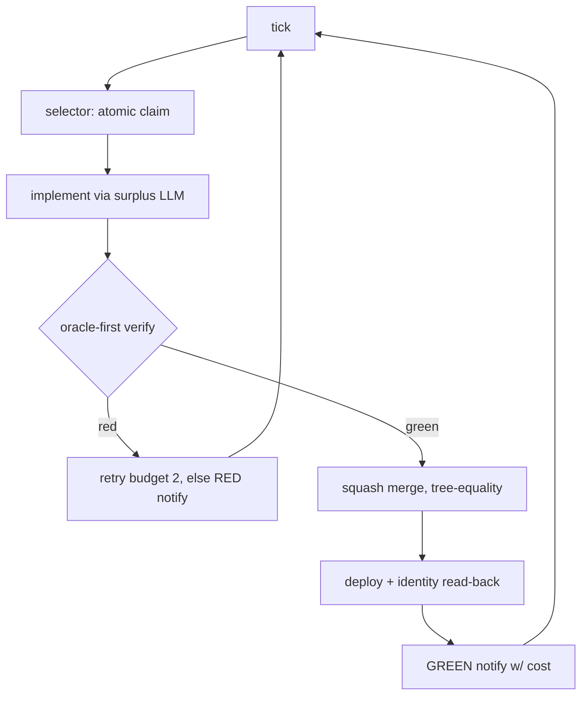

# POC Proposal — `factory-spike`: a time-boxed core-loop spike

For owner markup. 2026-09-23. Basis: UNATTENDED_FACTORY_PLAN.md (plan), FACTORY_PLATFORM_VERDICT.md
§F/§H + addendum (verdict), PITFALLS_AND_STRATEGIES.md (P1–P13), harvest/HARVEST.md (corpus),
FIRST_BUILD_VERIFICATION.md (protocol), AGENTS.md (license + verification bar).

---

## 1. The one question + why now

**Can our own code run factory laps — issue → implement → verify → merge → deploy — with zero
human interventions and zero false greens?**

Why now:

- **License forcing function.** The lab's `factory/` scaffolding derives from
  coleam00/ai-software-factory — UNLICENSED upstream (`license:null`; AGENTS.md "License rules",
  HARVEST.md "Do not copy"). It cannot ship. Prose-reference only; never copy verbatim.
- **The wrapped engine's failures are structural, not incidental** (proven on real laps):
  in-process idle watchdog insufficient — run 60b65fb8's timer armed, 61 resets, yet 2h silent hang
  with no abort effect (§H finding 1, plan Layer 1/5 corrections); resume only from
  `failed`/`paused` with 1-day `ORPHAN_RESUME_STALE_DAYS` window and a reaper-less orphan state
  (§F findings 1–2; harvest `archon-resumable-predicate-and-resume.ts`); **no notification hooks
  exist anywhere in-platform** (plan Layer 1: grep of cli/src found only chat adapters).
- **What's already proven** (§G/§H): the trust tail works — live runtime verification with
  per-assertion evidence, independent holdout, qualification, squash merge, deploy identity
  read-back — and runs cost $0.0001–0.0005/lap on surplus models.
- **What's NOT proven:** that anything can run laps *unattended*. Four daemon failure classes mean
  ~1 manual intervention per lap (§H final verdict) — a supervised autopilot, not a factory.
- **What we hold:** a licensed reference corpus (`harvest/`) covering exactly the missing
  components (HARVEST.md index: supervisor-loop, liveness-heartbeat, selector-claim,
  failure-model, trust-verification, tests).

The spike is **not** a framework. It answers one question with evidence.

## 2. Scope / non-goals

**The spike does** (single pipeline, one product, [redacted-host]):

1. Selector: atomic claim of the next open issue (NEEDLE pattern; HARVEST `selector-claim/`).
2. Agent execution: direct LLM calls via surplus gateway, one simple prompt per phase, fresh-context
   review (SELF_VERIFICATION §3a; kills P4/P5).
3. Verification, oracle-first: run the suite → scenario probes → adversarial repro gate before any
   green is trusted (HARVEST `no_human-repro-gate-docstring.py`; AGENTS.md P9 rule).
4. Evidence store: files + hashes, keyed by revision (trust lives in artifacts, not process state —
   §H finding 2).
5. Evidence-gated merge: `gh pr merge --squash --match-head-commit`, tree-equality check on main
   (bors rule, squash-adjusted — plan Layer 4).
6. Deploy: PID-file launch, identity read-back (`/health` revision == main HEAD; §H addendum 2).
7. Supervisor liveness: out-of-process; owner pid + fresh worktree writes, never the status row
   (plan Layer 2; P8). Recovery ladder resume→cancel→abandon; ntfy on every terminal state;
   failure model per Sortie park semantics (HARVEST `failure-model/`).

**The spike does NOT:** multi-project support, UI, GitHub Actions, scaling, generality, mutation
calibration scheduling, Archon integration of any kind. Also out: any new dependency (bash + python3 stdlib only), any config framework (literal values in settings.py), any abstraction with one implementation.

**Hard time-box: 5 working days.** If not green by day 5, that is a *finding* (the core loop
harbors a problem worth understanding), not a reason to extend.

## 3. Success criteria (measurable)

| # | Criterion | Class |
|---|---|---|
| S1 | 3 consecutive laps, zero human interventions | target |
| S2 | 0 false greens on hand-injected defects — requires authoring `defects.json` (currently `"defects": []` + `_scaffold` marker; §H addendum 4, P9) | **kill-criterion** |
| S3 | Cost/lap ≤ $0.01 and wall-clock ≤ 2× the Archon baseline ($0.0001–0.0005/lap, ~1.5h to merge gate, §F/§G/§H) — same 2× STOP rule as FIRST_BUILD_VERIFICATION item 10 | target cost; **kill-criterion** (2× STOP) |
| S5 | Every gate demonstrated red before trusted — each verifier fed a defect and observed failing (P9; AGENTS.md "Verification bar") | **kill-criterion** |
| S6 | All merges/deploy identity tree-bound: squash → compare `mergeCommit^{tree}` == PR head tree, never SHAs; deploy read-back matches (plan Layer 4; §H addendum 2) | **kill-criterion** |
| S7 | Notification received on every terminal state (GREEN w/ cost, RED w/ cause) | **kill-criterion** (silent terminal states void everything) |
| S8 | Outputs comparable across iterations: spike runs land in the same rig, so cost/latency/interventions/false-greens are directly comparable to the Archon baseline; runs stay attributable via run-id dirs | target |

A kill-criterion failed at day 5 = the answer is "no, here's the blocker" — still a deliverable.
S2/S5 are the anti-greenwash backstops: an unprovable gate is treated as absent. S3's cost+clock
bounds and S8's comparability share one pipeline: per-lap cost/latency/interventions/false-greens
logged in the evidence store, run-id-attributable.

## 4. Baseline comparison

| Metric | Archon lab (measured) | Spike target | How measured |
|---|---|---|---|
| Cost per lap | $0.0001–0.0005 (§F/§G/§H) | ≤ $0.01 | token accounting per lap in evidence store |
| Wall clock | ~1.5h to merge gate (§H); ~65min ship lap (§G) | ≤ 2× baseline | supervisor timestamps launch→merge |
| Human interventions | ~1/lap, 4 failure classes (§H verdict) | 0 across 3 laps | intervention log; any touch voids the lap (S1) |
| False greens | 1 major (§H: constant-literal provenance) | 0 on injected defects | defects.json run, every defect caught (S2/S5) |
| Failure recovery | resume-from-failed/paused only; orphans unreapable (§F.2) | every terminal state has a handler | selector outcome table + recovery ladder exercised |
| Notification | none in-platform (plan Layer 1) | every terminal state | ntfy receipts archived |

## 5. Architecture sketch

```
supervisor (Batty run/tick loop; harvest supervisor-loop/batty-run-tick-loop.rs)
  └─ tick: health → reconcile → dispatch → merge-tail (batty-tick-sequencing.rs)
      1. selector: atomic claim of next issue — CAS + fencing, handler per outcome
         (harvest selector-claim/needle-claim-strategy-fencing.rs, omnara-cron-claim.sql)
      2. agent execution: direct surplus-gateway LLM calls; one prompt per phase
         (issue→plan→implement→review); review is fresh-context, sees only diff+checklist
      3. verification (oracle-first): run tests → scenario probes → adversarial repro gate
         (harvest trust-verification/no_human-repro-gate-docstring.py)
      4. evidence store: append-only files + sha256, keyed by rev (survives crashes; §H.2)
      5. merge: gh pr merge --squash --match-head-commit; tree-equality on main
         (harvest trust-verification/gastown-batch-bisect.go, patterns.md bors)
      6. deploy: PID-file start; read back /health revision == main HEAD
      7. notify: ntfy on every terminal state; then loop
```



Liveness: heartbeat file + pid probe, TTL-based staleness (HARVEST
`liveness-heartbeat/needle-health-monitor.rs`) — never the status row (§F.1, §H). Failure model:
durable retry/park state, in-flight re-dispatch on supervisor restart (HARVEST
`failure-model/sortie-19-failure-model.md`).

**Language: Python** — the lab's verification tooling (`harness/ci.py`, scenario JSON drivers) is
already Python, stdlib `subprocess`/`hashlib`/`urllib` covers the entire spike; zero new runtime to
provision on [redacted-host].

## 6. License cleanliness statement

- **May copy** (with provenance headers per HARVEST.md format — repo, path:lines, SPDX,
  verbatim/excerpt marker): everything in `harvest/` — all MIT or Apache-2.0 (batty, NEEDLE,
  gastown, no_human, symphony, sortie: MIT; omnara: Apache-2.0; HARVEST.md index).
- **May NOT copy:** anything from ai-software-factory (unlicensed upstream) or the deployed
  `factory/` tree (`consumer.py`, `runtime_resource.py`) — prose description + path citation only
  (AGENTS.md license rules; the private-corpus user directive in HARVEST.md does not extend to a
  new codebase).
- **Archon is MIT** and may in principle be used as a component — but the spike must **not depend
  on it**: the spike's purpose is de-risking independence from the wrapped engine's failure modes
  (§1). No Archon import, no Archon runtime, no pin.
- Unclear cases → AGENTS.md escalation rule: stop and ask, not a mid-edit judgment call.

## 7. What we keep from the lab

- **Toy-product rig + issues + ALL accumulated artifacts** (`~/factory-lab/toy-product`,
  noor-latif/toy-product, and `~/.archon/workspaces/_local/toy-product/` — worktrees,
  `artifacts/runs/<run-id>/`, logs), **kept deliberately as the fixed calibration rig**: the
  measurement baseline every build iteration is compared against. §F/§H numbers are the reference
  points — $0.0001–0.0005/lap, ~1.5h to merge gate, ~1 intervention/lap — and run 60b65fb8's
  evidence chain is the worked example of a qualified lap's artifacts (§H findings 1–2, add. 1).
  The rig is unchanged; nothing on [redacted-host] is rebuilt or wiped.
- **[redacted-host] runtime** + surplus gateway config (`~/.pi/agent/models.json`, §F).
- **Docs**: verdict (evidence base), plan (Layer 3/4 compensating controls), PITFALLS (the catalog
  this spike's gates exist to kill), SELF_VERIFICATION (review/verify stack).
- **harvest/** corpus — the implementation reference for every spike component.
- **defects authoring task**: the 6–7 defect set in `harness/mutations/defects.json` is
  human-authored by hand (§H addendum 4) — prerequisite for S2, moved to day 1.
- **FIRST_BUILD_VERIFICATION.md** as the template: pre-launch checklist → during-lap STOP
  conditions → post-lap evidence-chain audit, reused wholesale as the spike's own acceptance
  protocol (its 6-step audit maps 1:1 onto spike gates).

## 8. LEARNINGS.md format

```markdown
## L-NNN: <title>
- What happened: <observable fact, no interpretation>
- Why: <root cause or best-supported hypothesis, labeled as such>
- What changes in the product build: <concrete rule/design change, or "none — noted">
- Evidence: <path:lines or transcript ref>
```

Rule: **every incident gets an entry the same day** — no batch reconstruction from memory. An
incident with no entry is a finding that rots (the defects.json "file size ≠ content" failure,
AGENTS.md verification bar).

Rule 2: **every iteration's summary ends with a baseline-comparison table row** —
`| <iteration> | laps | cost/lap | wall-clock | interventions | false greens |` — against the
Archon baseline (§4), so the comparison accumulates automatically instead of being re-derived.

## 9. Repo proposal

- **Name: `factory-spike`** (open decision, §10.4).
- **Location:** develop locally in `~/repos/factory-spike/`; run laps on [redacted-host] via ssh — same
  develop-local/run-remote pattern as the lab (AGENTS.md layout).
- **Skeleton:**
  - `src/` — exactly six modules, one file each: `supervisor.py` (tick loop + ntfy notify inline — notify is one urllib call, not a component), `selector.py` (atomic claim + outcome handlers), `agent.py` (surplus-gateway LLM calls, one prompt per phase, fresh-context review), `verify.py` (scenario-runner with probes, oracle-first), `merge.py` (squash + tree-equality gate), `deploy.py` (PID-file + identity read-back). Plus `settings.py`: literal values only — no config framework, no env-file parsing beyond what already exists
  - `tests/` — unit tests per component (HARVEST `tests/` files are the templates); stdlib `unittest`/`assert` only
  - `LEARNINGS.md` — §8 format, empty except the header
  - `PROD.md` — the spike's own spec: acceptance criteria as machine-checkable probes (PITFALLS playbook step 1; each criterion pairs a probe)
  - `scenarios/` — verification scenarios (provenance-clean: `FACTORY_RUNTIME_CANDIDATE` unset, assert observed revision == `git rev-parse HEAD`; §H addendum 2)
Anything beyond these six modules is v2 scope → LEARNINGS.md future-work note, not code.

## 10. Open decisions for the owner

1. **Language:** Python recommended (§5 rationale). Confirm or override (Go is the alternative if
   a single static binary on [redacted-host] is preferred).
2. **Time-box length:** 5 working days proposed. Confirm, or trade scope vs duration.
3. **Archon as component:** proposal excludes it entirely (§6 rationale: de-risking
   independence). Owner may permit it as a swappable component instead — not recommended.
4. **Repo name:** `factory-spike` proposed; confirm or rename.
5. *(Implicit, flagging for markup)* S3 cost ceiling: $0.01/lap is ~20× the Archon baseline —
   tighten to $0.005 for parity pressure, or keep headroom for gateway retries.
