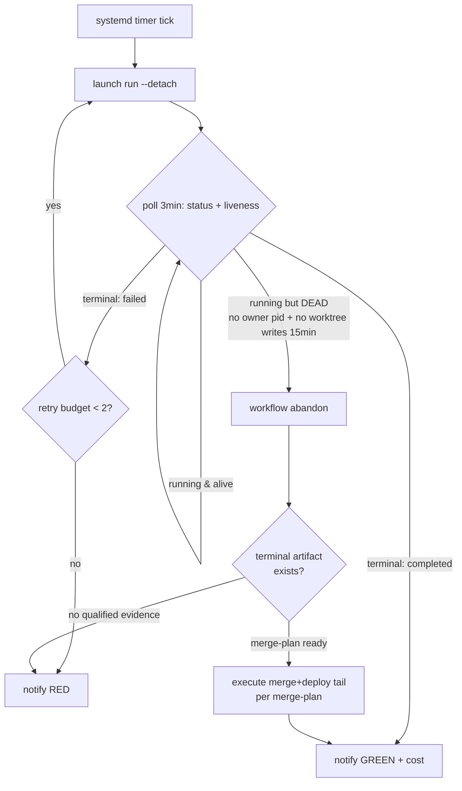

# Unattended Factory — Plan Forward

Goal: PRD → issues → PR → verified → merged → deployed with **zero human touches**, self-healing through all four observed failure classes. Basis: FACTORY_PLATFORM_VERDICT.md §A–H (4 failure classes: 3× SIGTERM at approval/publish, 1× silent 2h hang in post-merge refresh).

## Layer 0 — Model routing (DONE 2026-09-23)

- `~/.omp/agent/config.yml`: advisor = `surplus/glm-5.3-flash:high`, default = `surplus/glm-5.3-flash:high`, deepseek purged from fallback chain (confabulation risk). task=flash:high, smol=flash:low.
- Research verdict (docs.z.ai, Artificial Analysis, HN, sumedh.info effort sweep): effort is a reasoning-token budget dial; max ≈ full budget (~1.5× tokens of high), high already beats Opus 4.8 on Z.ai Code Bench at 40% fewer tokens. max has a documented thinking-loop failure mode (budget exhausted, zero output, 20-min timeouts — observed on 5.2 AND 5.3). Flash ≈ flagship on tool-use/agentic lanes (Toolathlon, AutomationBench, GDPval) at ~9× lower cost; flagship leads only on long-horizon text-only coding / HLE-type deep reasoning.
- Policy: **flash:high everywhere by default.** Escalate to `glm-5.3:high` only for the rare hard long-horizon coding lane. `flash:max` only after a demonstrated high-effort failure on our own traffic (no public flash high-vs-max ablation exists — A/B 50 real tasks before paying max routinely).

## Layer 1 — Platform-native unattended primitives (config only, no code changes)

Recon (pinned install 24796870, 2026-09-23) confirms all three exist:

1. **`--detach` on launch and gate response** (cli.ts:668-671, workflow.ts:533-559): child in own process group survives SSH/parent death. This kills failure classes 1–3 (SIGTERM at approval/publish via reaped shells). Launch: `python3 factory/consumer.py run archon-lifecycle ... ` via CLI with `--detach`; respond (if any gate remains): `workflow respond <id> approve --detach`. NOT supported in `--runtime-host` mode (consumer.py:241-242) — we don't use that mode.
2. **`merge_mode=auto`** (archon-merge-queue.yaml:13-15): "auto authorizes this batch" — the approval node's `when` clause only fires on mode=approve, so the interactive gate never runs. This removes the human from the merge decision.
3. **Per-node `idle_timeout`** (dag-executor.ts:2353, utils/idle-timeout.ts:16-22): 30-min default watchdog — **forensically insufficient**. Run 60b65fb8: timer armed (61 resets for the refresh step), should have fired 10:48:37 UTC, but no abort effect — run stayed `running` 2h until external cancel. Root-cause class (iii)/(iv): the abort either fired without propagating to a failed node, or the executor wedged first; firing is pino-log-only and no pino log exists for the run (unobservable), and idle-timeout.ts:74-77 deliberately avoids `generator.return()` because it would block on the pending `.next()`. Structural limits: the timer resets on EVERY yielded message type (any slow-drip wedge resets it forever); non-LLM nodes have no watchdog at all (only 2 withIdleTimeout call sites, both wrap aiClient.sendQuery); it's an in-process setTimeout — dead if the executor dies. External run-level liveness (Layer 2) is MANDATORY, not redundant.

No built-in run-completion notification hooks exist (grep of cli/src: only chat-platform assistant adapters). Scheduling: only `factory/factory-timer.service.example` (systemd timer, one run per tick).

## Layer 2 — External supervisor (the missing piece; ~150 lines of bash/python on [redacted-host])

A systemd service (or tmux-agnostic loop) that owns the unattended contract:

Rules (from the incident playbook, empirically validated in §F/§H):
- **Recovery ladder (status-branched, source-contract order)**: (1) state `failed`/`paused` → `factory resume <run-id>` FIRST (`--detach` is pure CLI-arg passthrough, consumer.py:322) — resume-with-skip replays completed nodes as `Skipped (prior_success)` and re-executes only incomplete nodes. Never cancel/abandon while resume is possible: only `failed`/`paused` are resumable (workflow-operations.ts:408-413), and `cancelled` is genuinely one-way — `recoverCancelledFanOutRun` revives only engine-cancelled fan-out children (workflows.ts:1046-1072). (2) state `running` but wedged → split by OWNER REACHABILITY: live-but-wedged owner → `workflow cancel` (cancel REQUIRES a reachable owner — it proves the live exact-run owner, terminates its tree, records cancelled; workflow.ts:4789-4792); dead/unreachable owner → `workflow abandon` after orphan verification (cancel refuses: "an unreachable owner never falls back to a DB-only transition"; workflow.ts:4796-4797). Both land in terminal `cancelled` — the only forward path either way is evidence-driven tail recovery; don't branch beyond choosing the command. (3) A wedged `running` run is NOT resumable in our window: the DB resume predicate is `status IN ('failed','paused') OR (status='running' AND (last_activity_at IS NULL OR older than 1 day))` (ORPHAN_RESUME_STALE_DAYS=1, db/workflows.ts:90,100-103; CLI findResumableRun workflow.ts:4627-4629,4707-4709) — a 2h wedge waits ~24h to become resumable, too late unattended; abandon+tail is correct for that class (a status flip would be out-of-contract DB surgery). (4) Before relaunching on the same working path, RELEASE first — the engine refuses to supersede a stale-running orphan until released (workflow.ts:3136-3141). Liveness input: `updateWorkflowActivity` maintains `last_activity_at` (workflows.ts:2231-2237) — a real heartbeat for the outer check; cross-check with owner pgrep + worktree writes.
- **Liveness ≠ "Status: running"**: a dead owner leaves the row `running` forever. Check (a) live `bun … workflow` process for this run (pgrep), (b) fresh writes under the run's worktree/artifacts (mtime < 5 min). Both dead for 15 min → wedged.
- **Abandon only on proven-dead owner with stopped worktree** — never on "cancel says no live owner reachable" alone (that means unreachable, not gone; a healthy lap was once killed that way).
- **Tail recovery is evidence-driven**: if runtime-qualification.md exists with ready=true, execute the merge+deploy tail per merge-plan (squash per plan, PID-file deploy, identity read-back). If not, notify and stop.
- **Retry budget 2 per lap** — transient provider stream errors ("Stream ended without finish_reason") are cheap (~$0.0002); a plain relaunch fixes them.
- **Notify on every terminal state** (GREEN with cost/node count, RED with last node + artifact pointer). ntfy.sh/webhook from the supervisor script — nothing exists in-platform.

## Layer 3 — Trust without the human merge gate

`merge_mode=auto` deletes the last human control. The compensating controls, all machine-checkable:

1. **Code-bound provenance in scenarios** (fix before next lap; path-split). Worktree-based scenario path: unset `FACTORY_RUNTIME_CANDIDATE` so `/health` reports real `git rev-parse HEAD`, and assert observed revision == expected head. Resource-root path: the git approach is unimplementable — the candidate is materialized by `git archive` (runtime_resource.py:167) with `.git` in the FORBIDDEN set (runtime_resource.py:19-20, RUNTIME_HOST.md:71-73), so the served root is not a checkout, and `/health` drops connections with the var unset (measured D2). Instead assert against the materialization record: `.factory-resource.json` carries source revision, tree, include list, and resource digest — pass the expected revision as a probe input and assert the observed revision/digest equals the recorded one. The §H scenarios' constant literal made revision assertions pass regardless of what code served — a false green an auto-merging factory cannot afford.
2. **Runtime + independent holdout both verified** (already enforced by qualify-runtime: verified=true ×2 + git HEAD == PR head).
3. **Mutation-calibration rung** (needs one human input first): author the 6–7 defect set in `harness/mutations/defects.json` (human-protected PERSONAL list, `defects: []` today — the rung scores nothing until written).
4. **Ordinary gate** (15 unit tests) green — already enforced.

## Phased rollout

| Phase | Content | Exit criterion |
|---|---|---|
| 1 | `--detach` + `merge_mode=auto` + provenance-fixed scenarios + PID-file deploy input; human watches but does not touch | 1 lap completes end-to-end with zero interventions |
| 2 | Supervisor script + notifications + retry budget; human on-call only | 3 consecutive laps zero touches, notifications received |
| 3 | systemd timer cadence + defects.json authored + mutation calibration gating auto-merge; escalation lane (glm-5.3:high) wired for triage-flagged hard slices | factory runs on a schedule; operator reviews weekly digest |

## Known residual risks

- The refresh-hang root cause is unknown (Layer 2 detects + recovers, doesn't prevent). If hangs recur per-lap, escalate upstream (coleam00/archon) with the 60b65fb8 transcript.
- Auto-merge means a subtle false-green (like the §H provenance hole) merges unreviewed. Layer 3 item 1 is the hard prerequisite; mutation calibration (item 3) is the backstop.
- Provider flakiness (stream errors) is absorbed by retries, but a hard rate limit mid-lap burns the retry budget — notify and stop is the correct behavior, not infinite retry.

## Layer 4 — Borrowed patterns (competitor research, 2026-09-23)

Full landscape: `/tmp/COMPETITOR_LANDSCAPE.md`. Key revisions to this plan:

- **Supervisor (Layer 2) = Batty's loop shape**: `poll → restart_dead_members → retry_failed → auto_dispatch → nudges → notify`, synchronous single loop, no async runtime. Our mermaid design maps 1:1 — validated.
- **Liveness = Windmill's zombie pattern**: ping/heartbeat-based (30s), never trust the status row. Matches our "liveness ≠ Status: running" rule.
- **Selector (new) = NEEDLE's atomic claim + exhaustive outcome table**: every outcome (success/failure/timeout/crash/race-lost/queue-empty) gets a defined handler; escalation ends in "alert human, wait" — bounded, never infinite.
- **Failure model = Sortie's park semantics**: retries/parks persisted (SQLite or files), in-flight work re-dispatched on supervisor restart, consecutive-absence ceiling (3) parks the target durably instead of re-running forever. Read Sortie's `docs/architecture/19-failure-model-and-recovery-strategy.md` before writing the supervisor.
- **Merge trust (Layer 3) += bors rule, squash-adjusted**: our merge method is squash (`merge_method=squash` input → `gh pr merge --squash`), so the verified PR head SHA never appears on main — identity is checked by TREE equality: `git rev-parse <mergeCommit>^{tree}` == `git rev-parse <PR head>^{tree}` (exact for a single-PR batch with unmoved base; a moved base means the tree differs and the check correctly fails → re-verify or hold). The rule's spirit is unchanged: main only ever advances through the exact tree state that passed verification. Use `gh pr view <n> --json mergeCommit` to get the merge commit. Decision record: squash chosen; matches §H precedent bf9ca06; SHA-preserving bors would need merge_method=rebase — not chosen.
- **Deploy trust += Google's verify-at-boundary**: record (git SHA + evidence hash) at merge time; deploy script refuses to run unless the service's declared revision matches the record (~20 lines, subsumes identity read-back).
- **Re-platform fallback**: if hangs recur per-lap and upstream doesn't fix, move the DAG to Windmill (zombie detection + retries + error webhooks + bash steps, self-hosted) — at the cost of reimplementing holdout/qualification semantics.
- **Sortie as supervisor chassis — evaluated, declined for now**: driving Archon from Sortie costs a Go adapter implementing `domain.AgentAdapter` (StartSession/RunTurn/StopSession, registered via `RegisterWithMeta` in init(); contract tests forbid orchestrator↔adapter imports) or an ACP-speaking `agent.command` — `consumer.py` is neither. Sortie's re-dispatch is a FRESH session (docs §14.3: "Running sessions are not recoverable"), which discards Archon's resume-with-skip — the artifact-preserving recovery that made the §H hang survivable — unless the adapter maps re-dispatch onto `factory resume`. Borrow its failure model; don't host on it yet.
- **omnara prior art (on disk, ~/repos/omnara)**: borrow the schema shapes — cron_triggers claim/lease, machine_failure_report jsonb (supervisor writes child-exit failure reports), machine_online_intervals lease-liveness (heartbeat TTL + staleness views, trigger-maintained), model_call_contexts recovery fields (recovery_kind/retry_at continuation after crash).
- **symphony = the spec, Sortie = the hardened impl**: openai/symphony is a language-agnostic spec-first orchestration SPEC (RFC-2119, Elixir reference impl, deliberately in-memory scheduler state); Sortie hardens exactly what Symphony leaves soft (SQLite retry/park/reaction recovery). Read as a pair when designing our supervisor's persistence.

## Layer 5 — Launch entry corrections (source-verified, consumer.py)

- The designed unattended entry is **systemd + `consumer.py tick`** (with `.factory/loop.sh` looping tick under `factory/factory-timer.service.example`, Restart=on-failure) — not SSH + `--detach` (detach is for interactive-hosted runs).
- `.factory/schedule.json` (workflow + per-tick inputs) does NOT exist yet — authoring it is a Phase-2 step. `pack.json` default_inputs for archon-lifecycle sets only `state_labels`, so **`merge_mode=auto` must be explicit in the schedule inputs** (the YAML default is `approve`).
- The tick path needs a **selector** (NEEDLE-pattern atomic claim): a static schedule re-runs the same target every tick forever. Selector picks the next unit of work (e.g. oldest open `archon-ready` issue without an open PR), takes the `.factory/locks/` lock, writes per-tick inputs, marks the target consumed.
- `factory/watchdog.py` and `factory/notify.py` are retired `refuse(...)` stubs — the liveness supervisor and notifications are new code, no compatibility surface to preserve.

### Corrections round 2 — source refinements (2026-09-23)

- **`refresh` node context**: it is an agent node inside `archon-merge-queue.yaml:108-151`'s `loop_group` (`until_bash: test $execute.output.done = true`, `max_iterations: 5`) — the in-run merge tail (`execute`) IS reachable; the §H hang occurred before it, not because of a missing node.
- **Watchdog scope clarification (Layer 1 item 3)**: the idle watchdog only wraps the agent message stream (`utils/idle-timeout.ts:48-95` wraps `aiClient.sendQuery`; call sites dag-executor.ts:2353/6349). A wedged daemon event loop produces NO timer at all — the strongest reason Layer 2 must be out-of-process and must not treat any in-process watchdog as a safety net. Also: no per-run pino log exists under `~/.archon/logs` for run 60b65fb8 — the absence of `dag_node_idle_timeout_reached` is NOT proof the timer never fired.
